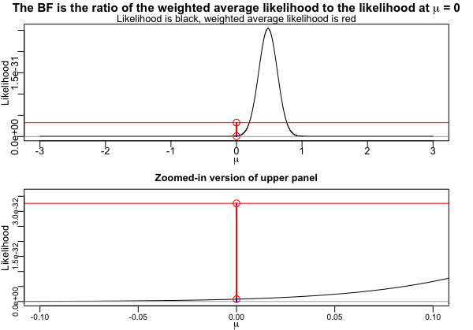

The `visualizeBF` package is useful for teaching about Bayes Factors,
providing two different visual interpretations of the concept.

This is mostly a toy package useful for teaching.

Installation
============

You need the `devtools` package to install this from github.

``` r
install.packages("devtools")
```

Then install `visualizeBF`.

``` r
devtools::install_github("mcbeem/visualizeBF")
```

And then load it.

``` r
library(visualizeBF)
```

Example
=======

First, simulate some data.

``` r
set.seed(1)
data <- rnorm(n=50, mean=.3, sd=1)
```

Visualize the BF as the ratio of the weighted average likelihood under
*H*<sub>1</sub> to the likelihood of the data under *H*<sub>0</sub> (via
`plot=1`).

``` r
visualizeBF(data, plot=1)
```



    ## $figure
    ## 
    ## $L.m0
    ## [1] 7.698952e-34
    ## 
    ## $L.m1
    ## [1] 3.266346e-32
    ## 
    ## $prior.mu0
    ## [1] 0.5280117
    ## 
    ## $posterior.mu0
    ## [1] 0.01244552
    ## 
    ## $BF10
    ## [1] 42.42585
    ## 
    ## $BF01
    ## [1] 0.02357053
    ## 
    ## $note
    ## [1] "Run dev.off() at the console to restore plot defaults."

Visualize the BF as the ratio of prior to posterior density under
*H*<sub>0</sub> (via `plot=2`).

``` r
visualizeBF(data, plot=2)
```


    ## $figure
    ## 
    ## $L.m0
    ## [1] 7.698952e-34
    ## 
    ## $L.m1
    ## [1] 3.266346e-32
    ## 
    ## $prior.mu0
    ## [1] 0.5280117
    ## 
    ## $posterior.mu0
    ## [1] 0.01244552
    ## 
    ## $BF10
    ## [1] 42.42585
    ## 
    ## $BF01
    ## [1] 0.02357053
    ## 
    ## $note
    ## [1] "Run dev.off() at the console to restore plot defaults."
